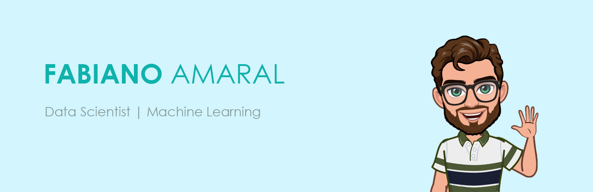

# Hi, I'm Fabiano :wave: :slightly_smiling_face:

## Who, am I?
* :octocat: Data Scientist 
* :paperclip: Artificial Intelligence Expert's Degree 
* :computer: Data Analysis with BI and Big Data Expert's Degree 
* :pager: Systems Analysis and Development Bachelor's Degree 
<!--
* :bar_chart: Business Specialist Degree  
-->

## Skills
* 🧮 Machine Learning
* 🔮 Probability
* 📊 Statistic
* :straight_ruler: Performance metrics
* 🐍 Python
* :milky_way: Scikit-learn
* :page_with_curl: Tensorflow
* :boom: Pyspark
* 🗄 SQL

## Find me around the world :earth_americas:

*  [Linked-in]( https://www.linkedin.com/in/fabianoamaralbr/)
*  [Instagram]( https://www.instagram.com/fabianoamaralbr/)
*  [X (twitter)]( https://www.x.com/fabianoamaralbr/)

## **My projects**

* [Machine Learning Model for Churn](https://github.com/fabianoamaralbr/churn_model_ml)
* [Decision Tree Algorithm Analysis](https://github.com/fabianoamaralbr/decision_tree_algorithm)
* [Linear Regression Algorithm Analysis](https://github.com/fabianoamaralbr/linear_regression_algorithm)
* [Python's Learning Exercises](https://github.com/fabianoamaralbr/AprendizadoPython)
* [EDA Brazilian E-commerce | Data Analysis in Power BI (2020)](https://app.powerbi.com/view?r=eyJrIjoiZWEwMDAyMDEtMGUyYy00Y2I1LTlhMzYtNmI1OTNhNjA2MGI5IiwidCI6IjcxZDU5YjAxLTIyY2EtNDYxYS1hYzRmLWIxMDNjMDY4NTQzYSJ9)
* [Financial Quote Report | Data Analysis in Power BI (2020)](https://app.powerbi.com/view?r=eyJrIjoiOTgwNzQzY2QtNjBiOC00NTY1LTg3MTgtNDhiYzIxNjI5NjQ2IiwidCI6IjcxZDU5YjAxLTIyY2EtNDYxYS1hYzRmLWIxMDNjMDY4NTQzYSJ9&pageName=ReportSection)

<!--
**amaralbr/amaralbr** is a ✨ _special_ ✨ repository because its `README.md` (this file) appears on your GitHub profile.
## **My projects**

* [Churn Model](https://github.com/scudilio/Churn_model)
* [Data Visualization](https://github.com/scudilio/Visualizacao_de_dados)
* [WebScrapin](https://github.com/scudilio/webscraping_wordcloud)
* [TextMining](https://github.com/scudilio/text_mining)

Here are some ideas to get you started:

- 🔭 I’m currently working on ...
- 🌱 I’m currently learning ...
- 👯 I’m looking to collaborate on ...
- 🤔 I’m looking for help with ...
- 💬 Ask me about ...
- 📫 How to reach me: ...
- 😄 Pronouns: ...
- ⚡ Fun fact: ...
-->

